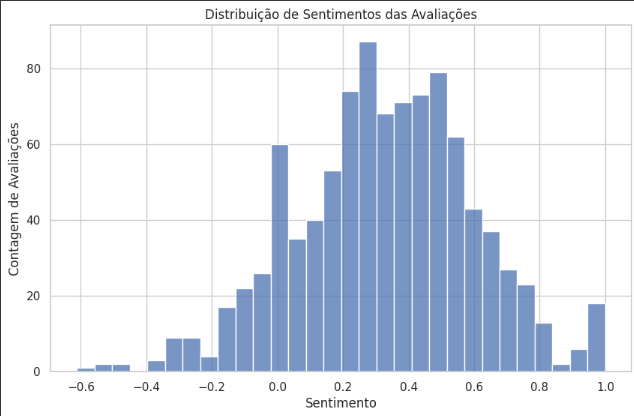
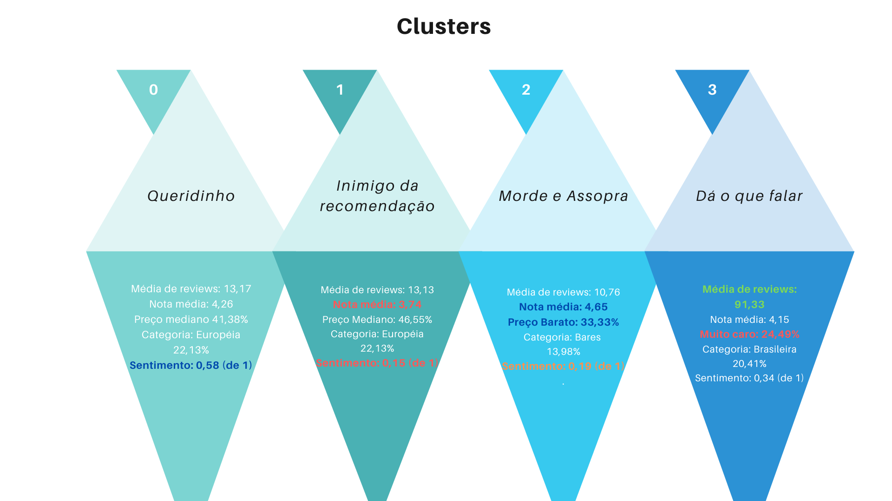

# Recomendacao_Restaurantes_Yelp

   

  

## Objetivo

O propósito do projeto é criar um projeto de portifólio usando dados reais! A ideia aqui é pegar dados de 1000 restaurantes do Rio de Janeiro com uma API disponibilizada pela Yelp. Assim, ao final do projeto posso criar um algoritmo de recomendação com base nos estabelecimentos e nas reviews dos usuários.

## Instruções para Execução dos Notebooks em Python Localmente
1. Instale as dependências necessárias.
2. Execute os notebooks como de costume, usando um servidor Jupyter Notebook, Vscode, etc.

## Pipeline

                       ┌─────────────────┐
                       │ Obter Dados de  │
                       │ API da Yelp     │
                       └─────────────────┘
                                │
                                ▼
                       ┌─────────────────┐
                       │ Data Preparation│
                       │                 │
                       └─────────────────┘
                                │
                                ▼
                       ┌─────────────────┐
                       │     Feature     │
                       │   Engineering   │
                       │                 │
                       └─────────────────┘
                                │
                                ▼
                       ┌─────────────────┐
                       │ Pre-processing  │
                       └─────────────────┘
                                │
                                ▼
                       ┌─────────────────┐
                       │     Machine     │
                       │     Learning    │
                       └─────────────────┘
                                │
                                ▼
                       ┌─────────────────┐
                       │     Results     │
                       └─────────────────┘

## Data Extraction

 - Obtenção dos dados: A Yelp disponibiliza uma API para quem pedir a chave de acesso. A API disponibiliza uma ampla gama de informações dos estabelecimentos cadastrados. Eu optei por fazer meu porojeto com base em restaurantes no Rio de Janeiro. O acesso é limitado a 500 requisições por dia. Além disso, a pesquisa só pode ser feita em até 1000 estabelecimentos. Fora isso, a maior parte dos serviços cadastrados no site não são brasileiros, e isso limita algumas informações importantes.
 - Problema: Como a API só oferece 500 requisições diárias, eu precisei criar um método para buscar as informações das reviews, já que cada restaurante tem pelo menos 3 reviews. Pois então eu dividi meu dataset de negócios que possui 1000 estabelecimentos em 4. Assim, eu poderia buscar informações sem estourar o limite diário, mas com atraso de 4 dias no projeto.

	_Ferramentas: Pandas, requests_

 

## Data Preparation
  
- Extração de Dados: Inicialmente, o código faz solicitações à API do Yelp para obter informações sobre restaurantes em uma localização específica. Os resultados são armazenados em um DataFrame do pandas. Para contornar as limitações da API, os dados são divididos em partes (df1, df2 e df3).

- Extração de Dados de Revisões: O código também faz solicitações separadas para obter informações detalhadas das revisões de cada restaurante. Essas informações são armazenadas em DataFrames separados (df1_reviews, df2_reviews e df3_reviews).

- Concatenação de DataFrames: Após a extração, os DataFrames de revisões são concatenados em um único DataFrame (all_reviews_df) para facilitar a análise conjunta.

- Limpeza de Dados: São realizadas operações de limpeza nos dados, como tratamento de valores ausentes, conversão da coluna "price" em valores numéricos e mapeamento de categorias de restaurantes para categorias mais amplas.

- Integração de Dados: O DataFrame de restaurantes e o DataFrame de revisões são combinados usando a coluna "restaurant_id" para criar um DataFrame final (merged_df) que contém informações sobre restaurantes e revisões. Colunas irrelevantes são removidas para simplificar o conjunto de dados.

  	_Ferramentas: Pandas, requests, json, ast, google.colab_
  
 ## Feature Engineering

- No final, grande parte do pre-processamento foi feito durante o data preparation por conta dos merges e concats que foram feitos. Também foi feito para o algortimode clusterização e para o de recomendação.
  
	_Ferramentas: Pandas, sklearn_

 ## Machine Learning
	
  ### Sentiment Analisys
  -Análise de Sentimento: Foi definida uma função para calcular o sentimento de texto usando a biblioteca TextBlob. Essa função foi aplicada à coluna "text" do DataFrame combined_final_df para calcular o sentimento de cada avaliação.

 -Visualização de Dados: Foram criadas visualizações de dados para entender a distribuição de sentimentos nas avaliações e sua relação com outras variáveis:

-Histograma de Distribuição de Sentimentos: Mostrou a distribuição de sentimentos nas avaliações, destacando uma predominância de sentimentos positivos.

-Gráfico de Dispersão de Sentimentos vs. Avaliações: Mostrou a tendência geral de sentimentos mais positivos em avaliações com mais estrelas.

-Piores e Melhores Restaurantes por Sentimento: Foram identificados os 30 restaurantes com as piores e melhores avaliações com base no sentimento das avaliações. Os resultados foram apresentados em gráficos de barras que mostraram as categorias mais comuns dos restaurantes com baixo e alto sentimento.

-Análise de Preço e Sentimento: Explorou-se a relação entre a faixa de preço dos restaurantes e a pontuação de sentimento das avaliações por meio de um gráfico de dispersão.

  

 ### Clustering

 -Seleção de Características: Foram selecionadas colunas relevantes para a análise, incluindo características numéricas como "review_count", "rating" e "sentiment", bem como características categóricas como "category" e "price".

-Pré-Processamento de Dados: Foi criado um pipeline de pré-processamento de dados que normalizou as características numéricas e aplicou codificação one-hot nas características categóricas.

-Determinação do Número de Clusters: Foi utilizado o método do cotovelo para determinar o número ótimo de clusters. Um gráfico mostrando a variação da soma dos quadrados dentro do cluster em relação ao número de clusters foi gerado.

-Aplicação do Algoritmo K-Means: O algoritmo K-Means foi aplicado aos dados com o número ótimo de clusters (4) determinado anteriormente. Os clusters resultantes foram adicionados ao DataFrame.

-Visualização dos Clusters: Foi criado um gráfico de dispersão para visualizar como os restaurantes estão agrupados com base nas avaliações de "rating" e "sentiment", coloridos de acordo com os clusters.

-Análise dos Clusters: Uma análise das médias das características em cada cluster foi realizada, identificando tendências ou características distintivas em cada grupo. Isso incluiu a média de "rating", "sentiment" e outras variáveis.

-Análise Detalhada dos Clusters: Foi realizada uma análise detalhada das características de cada cluster, mostrando a distribuição das categorias de restaurantes, faixas de preço e outras características em cada grupo.

-Visualização de Interpretação dos Clusters: Uma imagem foi incluída para ajudar na interpretação visual dos clusters.

  

### Recommendation algorithm
- Em processo...

  
## Results
- Em processo...

   

  

  
